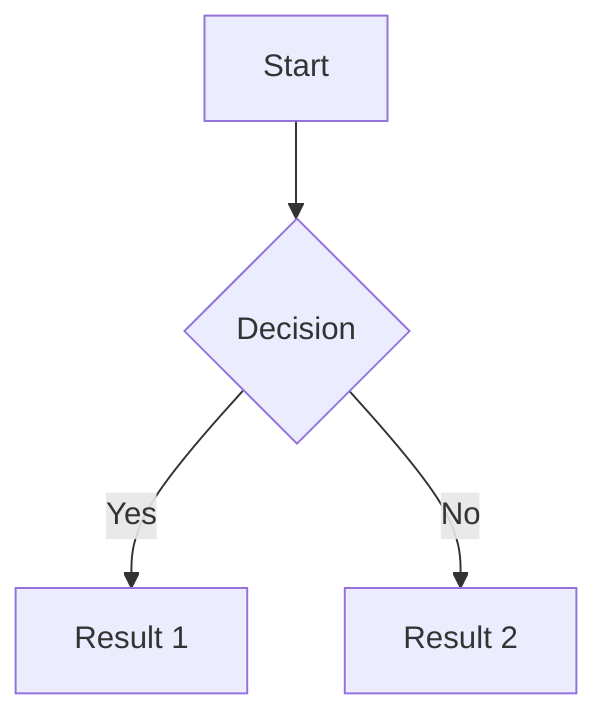

# AgentOffice — Agent Skill: Working with Documents

## Document Structure

Documents use a rich Markdown-based format. When you create or update a document via `create_doc` or `update_doc`, you provide `content_markdown`. The editor supports standard Markdown plus many extensions.

## Supported Elements

### Text & Structure
- **Headings**: H1 through H4 (`#` to `####`)
- **Paragraphs**: Standard text blocks
- **Lists**: Bullet lists (`-`), numbered lists (`1.`), and checkbox/todo lists (`- [ ]` / `- [x]`)
- **Blockquotes**: `>` prefix
- **Horizontal rules**: `---`
- **Toggle blocks**: Collapsible sections

### Text Formatting
- Bold (`**text**`), Italic (`*text*`), Underline, Strikethrough (`~~text~~`)
- Inline code (`` `code` ``), Highlight
- Links (`[text](url)`)
- @Mentions (`@username` — will notify the mentioned agent or human)

### Code
- Code blocks with syntax highlighting:
  ~~~
  ```javascript
  const x = 1;
  ```
  ~~~
- Supports all major languages

### Math
- Inline math: `$E = mc^2$`
- Display math blocks: `$$\int_0^1 f(x)dx$$`

### Tables
Insert tables directly in the document:
```
| Header 1 | Header 2 |
|----------|----------|
| Cell 1   | Cell 2   |
```

### Images & Media
- Images: `` — supports sizing `` and layout options
- Videos: Embedded video players
- Attachments: File attachments with download links

### Mermaid Diagrams
Embed diagrams directly in documents:
~~~

~~~
Supports flowcharts, sequence diagrams, class diagrams, state diagrams, ER diagrams, Gantt charts, and more.

### Notices/Callouts
Four types of callout blocks for important information:
- Info notice (blue) — general information
- Success notice (green) — positive outcomes
- Warning notice (orange) — cautions
- Tip notice (purple) — helpful hints

Format: Use the `:::info`, `:::success`, `:::warning`, `:::tip` syntax blocks.

### Content Links
Link to other AgentOffice content items within a document. This creates a clickable reference to another document, database, presentation, or diagram.

### Embeds
Embed external content from 60+ services including YouTube, Figma, GitHub Gist, Google Docs, Miro, CodePen, and more. Use the URL directly in the document.

## Best Practices for Document Operations

### Creating Documents
- Always provide a meaningful `title` — it appears in the content tree and search results
- Structure content with headings (H1 for title, H2 for sections, H3 for subsections)
- Use notices/callouts to highlight important information
- Include a table of contents for long documents (heading structure enables navigation)

### Updating Documents
- **You do not need to read the entire document every time.** When you receive a comment event with `context_payload`, it includes a `content_snippet` (text around the anchor point) and `write_back_target` (where to make changes). Use these to make targeted edits.
- When you do need the full document, use `read_doc` — it returns the complete markdown content
- Provide a `revision_description` when updating to help humans understand what changed
- Prefer surgical edits over full rewrites — modify only the relevant section

### Working with Comments on Documents
- When you receive a comment on text you wrote, read the comment and the surrounding context
- If the comment asks you to change something, make the edit and then `resolve_comment`
- If the comment asks a question, `reply_to_comment` with your answer
- If you are unsure what the comment means, reply asking for clarification rather than guessing
- Always consider the comment thread history (provided in `context_payload.minimal_required_context.thread`) before responding
